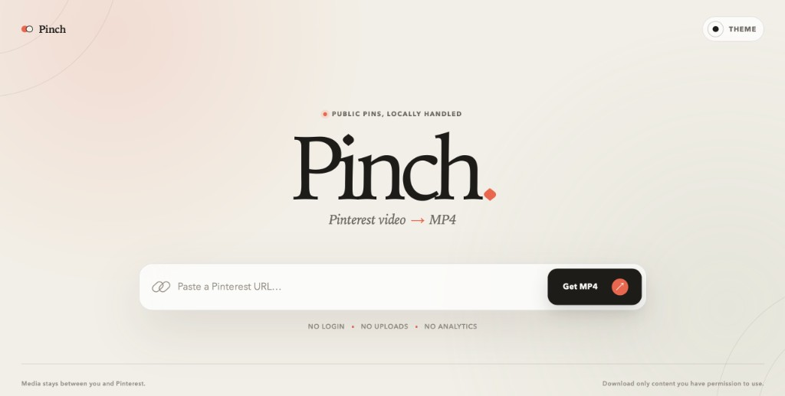

# Pinch

Resolve a public Pinterest video Pin to a previewable, savable MP4.

[English](README.md) · [中文](README-CN.md) · [Live demo](https://ingeniousfrog.github.io/Pinch/)



Pinch is a static browser utility for one job: paste a public Pin URL and obtain the best progressive MP4 Pinterest exposes. There are no accounts, uploads, analytics, boards, profiles, images, or batch scraping.

## Overview

| Area | Detail |
| --- | --- |
| Scope | Public `pinterest.com/pin/<numeric-id>` URLs, including full `/sent/` share URLs, common subdomains, and locale domains |
| Media preference | Progressive MP4 first; HLS is detected and reported when browser access is blocked |
| Download policy | Blob download when readable; honest “open original” fallback when CORS blocks file access |
| Deployment | Vite static site for GitHub Pages with production base `/Pinch/` |
| Privacy | No runtime npm dependencies in production; resolution runs in-browser against Pinterest |

## Usage

1. Open the [live demo](https://ingeniousfrog.github.io/Pinch/), or run the local development server.
2. Paste a public Pin URL such as `https://www.pinterest.com/pin/<numeric-id>/`. Full Pinterest `/sent/` share URLs also work.
3. Select **Get MP4** and preview the best progressive source Pinch found.
4. Follow the action Pinch shows:
   - **Download MP4** — the browser can read the original bytes and save a Blob without re-encoding.
   - **Open MP4** — this origin cannot read the file. Open the media, then use the browser’s save command.

Opening a source is never reported as a completed download.

## Supported and unsupported

**Supported**

- Public `pinterest.com/pin/<numeric-id>` URLs
- Full Pinterest share URLs ending in `/sent/` (query parameters are ignored)
- Ordinary subdomains such as `www.pinterest.com`
- Locale domains such as `pinterest.co.uk`
- Progressive MP4 sources on Pinterest’s `v*.pinimg.com` video CDN
- HLS detection with an explicit capability error when browser access is blocked

**Not supported**

- Automatic `pin.it` short-link resolution. The static app explains how to open the short link and copy the full `pinterest.com/pin/...` URL instead.
- Private Pins, authentication, accounts, or cookies
- Boards, profiles, images, feeds, search, and bulk downloads
- Arbitrary CORS proxies, third-party download sites, or server-side relays
- DRM, access-control bypasses, or rate-limit evasion

## How it works

```text
public Pin URL
  → detect pin.it short links and explain the static-app workaround
  → validate and extract numeric Pin ID
  → fetch Pinterest’s public widget JSON
  → recursively normalize supported video representations
  → reject non-Pinterest media URLs
  → deduplicate and rank MP4 before HLS
  → probe whether the selected media is browser-readable
  → download original MP4 bytes or open the opaque source honestly
```

A normal Pin page includes useful embedded JSON, but does not grant foreign origins access to the response body. The static resolver therefore uses the public JSON endpoint behind Pinterest’s widget mechanism. That endpoint requires no login or secret, but it is undocumented and may change, so it is isolated behind `PinResolver` and covered by sanitized fixtures.

The extractor recognizes nested story-Pin media, `video_list`, `videoList`, `videoUrls`, structured page JSON, and Open Graph video metadata. The UI only receives normalized `PinVideo` and `VideoSource` objects.

## Privacy and trust boundaries

- Pin resolution runs in the browser directly against Pinterest.
- Pinch has no application server and stores no video.
- Progressive media bytes never pass through a Pinch service.
- No Pinterest login, cookie, or API credential is requested or stored.
- No analytics are included by default.
- The production build has no runtime npm dependencies.

## Browser limitations

For public video Pins, current browser-side results are:

| Capability | Result |
| --- | --- |
| Public widget JSON resolution | Works from a static origin with CORS |
| Progressive MP4 preview | Works as opaque cross-origin media |
| MP4 `fetch()` / Blob download | Blocked by Pinterest CDN CORS |
| Cross-origin `download` link | Opens media; does not emit a file download |
| HLS playlist and segment access | Blocked by Pinterest CDN CORS |
| Browser-side HLS → MP4 remux | Not reachable from GitHub Pages |

No Service Worker, `mode: "no-cors"`, or WebAssembly media library can make an unreadable cross-origin response readable. Pinch therefore does not ship idle remux dependencies such as `ffmpeg.wasm`.

## Local development

Requirements: Node.js 24 and npm.

```sh
npm ci
npm run dev
```

Vite prints the local URL in the terminal. Because the production base is `/Pinch/`, local development uses the same path prefix.

Verification commands:

```sh
npm test                 # deterministic unit and DOM tests
npm run test:coverage    # enforced 80% thresholds
npm run typecheck
npm run build
npm run test:e2e         # Playwright, including optional live probes
npm run verify           # typecheck, coverage, and production build
```

The live Playwright suite is separate from default unit tests because Pinterest’s network behavior can change independently of Pinch. Live Pin IDs and media URLs are not committed. Set these locally:

- `PINCH_LIVE_PIN_ID`
- `PINCH_LIVE_PIN_MP4_URL`
- `PINCH_LIVE_PIN_HLS_URL`
- optional second pin: `PINCH_LIVE_PIN_2_*`

Without those variables, live probes are skipped.

## GitHub Pages deployment

A push to `main` runs `.github/workflows/deploy-pages.yml`, verifies the project, builds `dist/`, and deploys with GitHub’s official Pages actions.

For the first deployment:

1. Open the repository **Settings → Pages**.
2. Set **Source** to **GitHub Actions**.
3. Push to `main`, or run **Deploy GitHub Pages** manually from Actions.

Site URL: https://ingeniousfrog.github.io/Pinch/

## Attribution

Pinch is an independent TypeScript implementation. Single-Pin behavior was studied against Lim Kok Hole’s MIT-licensed [`pinterest-downloader`](https://github.com/limkokhole/pinterest-downloader), particularly embedded Pin objects, `videos.video_list`, story Pin blocks, and progressive quality selection. Its board, profile, and image downloader architecture was not ported.

## Disclaimer

Pinch is an independent technical utility and is not affiliated with, endorsed by, or sponsored by Pinterest. Users are responsible for downloading only content they own or have permission to use, and for complying with applicable terms and law.

MIT licensed. See [LICENSE](LICENSE).
